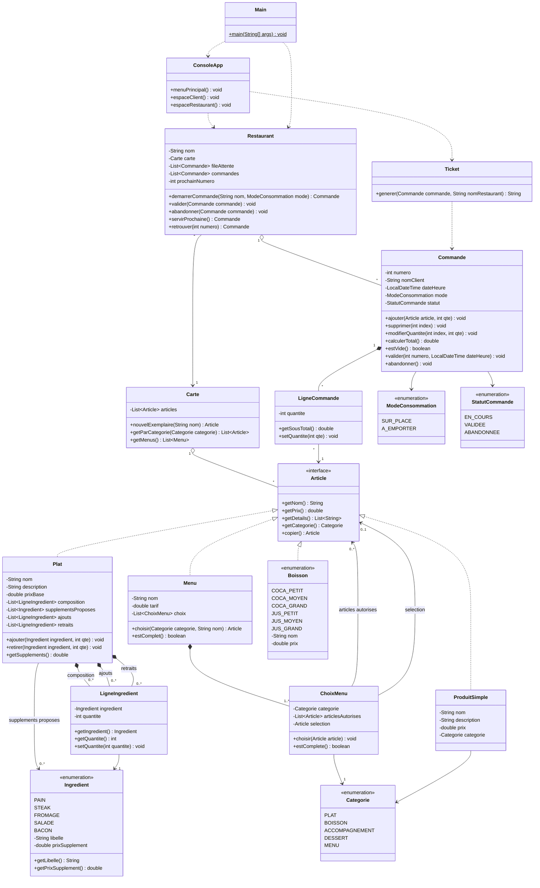

# Diagramme UML - Gestion Restaurant

```mermaid
classDiagram
direction TB

class Article {
  <<interface>>
  +getNom() String
  +getPrix() double
  +getDetails() List~String~
  +getCategorie() Categorie
  +copier() Article
}

class Plat {
  -String nom
  -String description
  -double prixBase
  -List~LigneIngredient~ composition
  -List~Ingredient~ supplementsProposes
  -List~LigneIngredient~ ajouts
  -List~LigneIngredient~ retraits
  +ajouter(Ingredient ingredient, int qte) void
  +retirer(Ingredient ingredient, int qte) void
  +getSupplements() double
}

class LigneIngredient {
  -Ingredient ingredient
  -int quantite
  +getIngredient() Ingredient
  +getQuantite() int
  +setQuantite(int quantite) void
}

class ProduitSimple {
  -String nom
  -String description
  -double prix
  -Categorie categorie
}

class Menu {
  -String nom
  -double tarif
  -List~ChoixMenu~ choix
  +choisir(Categorie categorie, String nom) Article
  +estComplet() boolean
}

class ChoixMenu {
  -Categorie categorie
  -List~Article~ articlesAutorises
  -Article selection
  +choisir(Article article) void
  +estComplete() boolean
}

class Carte {
  -List~Article~ articles
  +nouvelExemplaire(String nom) Article
  +getParCategorie(Categorie categorie) List~Article~
  +getMenus() List~Menu~
}

class LigneCommande {
  -int quantite
  +getSousTotal() double
  +setQuantite(int qte) void
}

class Commande {
  -int numero
  -String nomClient
  -LocalDateTime dateHeure
  -ModeConsommation mode
  -StatutCommande statut
  +ajouter(Article article, int qte) void
  +supprimer(int index) void
  +modifierQuantite(int index, int qte) void
  +calculerTotal() double
  +estVide() boolean
  +valider(int numero, LocalDateTime dateHeure) void
  +abandonner() void
}

class Restaurant {
  -String nom
  -Carte carte
  -List~Commande~ fileAttente
  -List~Commande~ commandes
  -int prochainNumero
  +demarrerCommande(String nom, ModeConsommation mode) Commande
  +valider(Commande commande) void
  +abandonner(Commande commande) void
  +servirProchaine() Commande
  +retrouver(int numero) Commande
}

class Ticket {
  +generer(Commande commande, String nomRestaurant) String
}

class ConsoleApp {
  +menuPrincipal() void
  +espaceClient() void
  +espaceRestaurant() void
}

class Main {
  +main(String[] args)$ void
}

class Boisson {
  <<enumeration>>
  COCA_PETIT
  COCA_MOYEN
  COCA_GRAND
  JUS_PETIT
  JUS_MOYEN
  JUS_GRAND
  -String nom
  -double prix
}

class Ingredient {
  <<enumeration>>
  PAIN
  STEAK
  FROMAGE
  SALADE
  BACON
  -String libelle
  -double prixSupplement
  +getLibelle() String
  +getPrixSupplement() double
}

class Categorie {
  <<enumeration>>
  PLAT
  BOISSON
  ACCOMPAGNEMENT
  DESSERT
  MENU
}

class ModeConsommation {
  <<enumeration>>
  SUR_PLACE
  A_EMPORTER
}

class StatutCommande {
  <<enumeration>>
  EN_COURS
  VALIDEE
  ABANDONNEE
}

Article <|.. Plat
Article <|.. Boisson
Article <|.. ProduitSimple
Article <|.. Menu

Plat *-- "0..*" LigneIngredient : composition
Plat *-- "0..*" LigneIngredient : ajouts
Plat *-- "0..*" LigneIngredient : retraits
Plat --> "0..*" Ingredient : supplements proposes
LigneIngredient --> "1" Ingredient

Menu *-- "1..*" ChoixMenu
ChoixMenu --> "1" Categorie
ChoixMenu --> "0..*" Article : articles autorises
ChoixMenu --> "0..1" Article : selection

ProduitSimple --> Categorie
Commande --> ModeConsommation
Commande --> StatutCommande

Carte "1" o-- "*" Article
Restaurant "1" o-- "*" Commande
Commande "1" *-- "*" LigneCommande
Restaurant "1" --> "1" Carte
LigneCommande "*" --> "1" Article

Ticket ..> Commande
ConsoleApp ..> Restaurant
ConsoleApp ..> Ticket
Main ..> ConsoleApp
Main ..> Restaurant
```